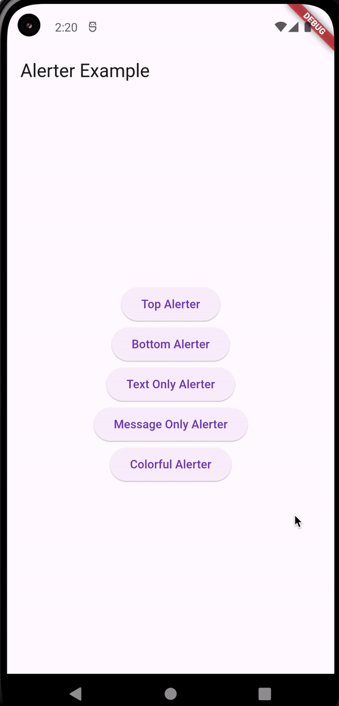

# Alerter
**Alerter** is the flutter package that shows custom alert/snackbar to the user. It is highly customizable and easy to integrate.  


## Usage

To use the package, add `alerter` as a dependency in your `pubspec.yaml` file.

```dart
import 'package:alerter/alerter.dart';
```

You can use it as

```dart
  void showAlerter() {
    Alerter.show(
      context,
      title: 'This is title',
      message: 'This is a message.',
      icon: Icons.check_circle,
      position: OverlayPosition.bottom,
    );
  }
```


## Screenshot



## Properties

Property | Description | Default
--------|------------|------------
context | BuildContext | Required
message | Alerter message | Required
title | Title of the alerter | null
backgroundColor | Alerter background color | black87
textColor | Alerter text color | white
iconColor | Alerter icon color | white
icon | IconData of the icon | null
iconSize  | Icon size if icon is provided | 35
isIconAnimated | Indicates if the icon should be animated  |  true
duration  |  Indicates for how long the alerter should be active  |  OverlayDuration.normal
position  |  Indicates the position of the alerter  |  OverlayPosition.bottom


### Contribution
You are open to contribute to this package in any way you want like opening a **PR** or **Issues**

